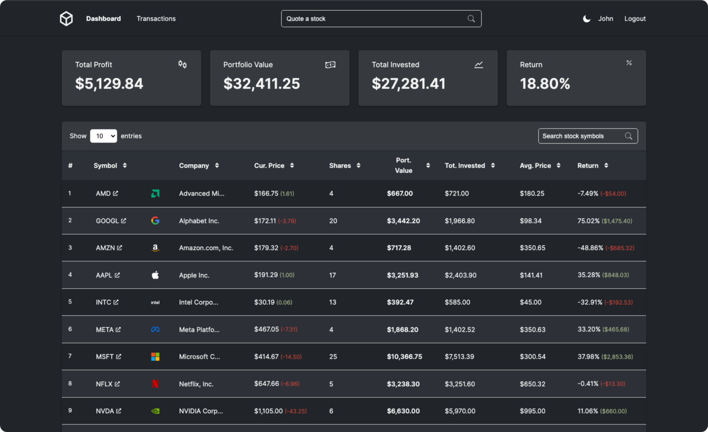

# Investly

**Investly** is a full-stack stock management app that allows users to add, edit, and delete transactions, track the performance of their portfolio, and check detailed information about stocks.

## Table of Contents

- [Technologies Used](#technologies-used)
- [Features](#features)
- [Usage](#usage)
- [Project Structure](#project-structure)
- [Screenshots](#screenshots)
- [License](#license)

## Technologies Used

- **Design**: 
- **Frontend**:   
- **Backend**:  
- **Database**:  
- **Hosting**: 

## Features

- **Stock Information**: Access detailed information about stocks, including price history and key metrics, using a third-party API.

 

- **Portfolio Performance**: Monitor the performance of your investment portfolio in real-time.

 

- **Manage Transactions**: Easily log and edit your stock transactions including buys and sells.

 

- **Theme M:** Customizable theme that includes both light and dark options for a more comfortable viewing experience.

 

- **User Authentication**: Secure user authentication and session management.

## Usage

To use the application:

1. Navigate to [Investly Live Demo](http://investly.keomalima.com).
2. Register or use the demo user.
3. Start adding transactions from your favorite stocks (ie: AAPL, MSFT, DIS etc) and monitor your portfolio performance.

## Project Structure

- **Frontend**: Built with React, using Vite and Redux for state management. The UI is designed in Figma. All components, including forms, cards, and tables, were created manually, with minimal use of external libraries.
- **Backend**: Powered by Node.js and Express, with Sequelize managing database interactions and PostgreSQL as the database.
- **Database**: Utilizes PostgreSQL for storing user and stock data, accessed and manipulated through Sequelize ORM.
- **Third-Party API**: Used to fetch real-time stock information and historical data.

### Key Files and Directories

- `frontend/`: Contains all the React components, Redux store, and assets.
- `backend/`: Includes Express server setup, API routes, and database models.

## License

This project is licensed under the MIT License - see the [LICENSE](LICENSE) file for details.
